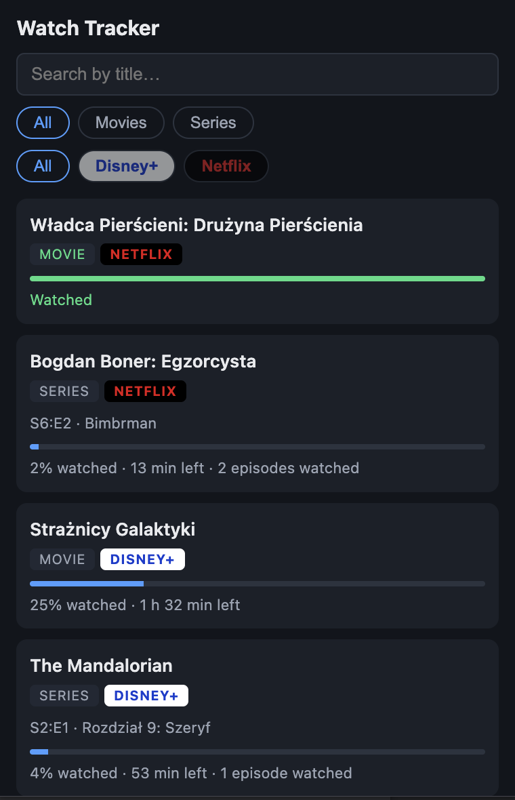
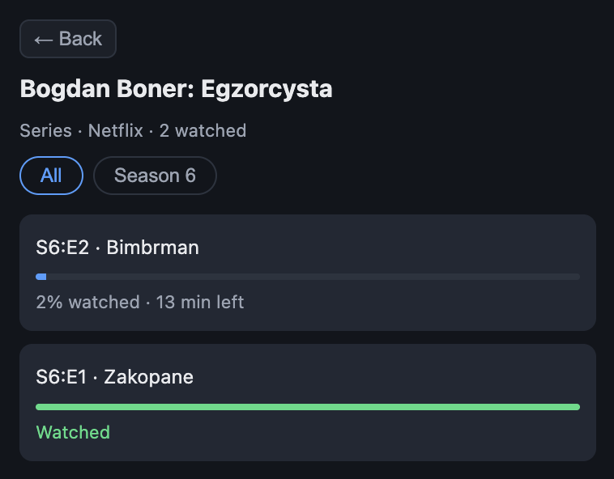

# Watch Tracker

A Chrome extension that remembers what you watch on **Netflix** and **Disney+** — movies and
episodes, how far you got and how much is left — and keeps that history locally, independent of
what each platform does with its own.

  
  

## Features

- Tracks movies and episodes automatically while they play — title, season, episode, progress
  and time left
- Marks a title as watched when the platform's end screen appears; anything missed can be marked
  by hand
- Groups episodes by series, with a per-season view
- Search, plus filters by type (movie / series) and platform

## Tech stack

- **Manifest V3** Chrome extension
- **Vanilla JavaScript, HTML and CSS** — no framework, no build step
- **`chrome.storage.local`** for the history
- **`MutationObserver`** and shadow DOM traversal to read the players' UI

## Install

1. Clone the repo
2. Open `chrome://extensions` and turn on **Developer mode**
3. **Load unpacked** → select the repo folder

## Limitations

The extension reads each platform's player UI, which neither platform documents, so a redesign
can break it. The findings it relies on are written down in
[`docs/selectors-netflix.md`](docs/selectors-netflix.md) and
[`docs/selectors-disneyplus.md`](docs/selectors-disneyplus.md). On Netflix the season is read from
the episode selector, which briefly opens when a new episode starts.
